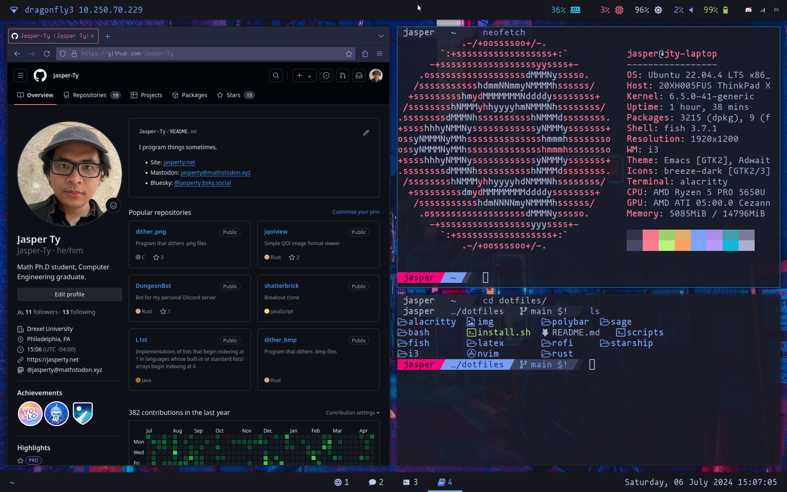

# dotfiles

## About

This holds configs for my setup. My laptop (Thinkpad X13 Gen 2a) is the source of truth. I took lots of inspiration on the scripting side from [James Shackleford's dotfiles](https://github.com/tshack/dotfiles).

This is still very much a work in progress! Hope to iron this out in grad school.

This setup is partially replicated on my Desktop PC, my Raspberry Pi, and on a VPS I maintain.

## Info

- **OS:** Ubuntu 22.04 LTS
- **Font**: [Mononoki](https://github.com/madmalik/mononoki) [Nerd Font](https://www.nerdfonts.com/)
- **Window Manager:** [i3](https://i3wm.org/)
- **Status Bars:** [polybar](https://github.com/polybar/polybar)
- **Terminal:** [alacritty](https://github.com/alacritty/alacritty)
- **Shell:** [fish](https://fishshell.com/)
- **Text Editor:** [Neovim](https://neovim.io/)
- **PDF Viewer:** [zathura](https://pwmt.org/projects/zathura/)
- **Multiplexer:** [Zellij](https://zellij.dev/)
- **Browser:** [Firefox](https://www.mozilla.org/en-US/firefox/)
- **App Launcher:** [rofi](https://github.com/davatorium/rofi)
- **Color Scheme:** Tokyo Night

### Misc

I use TeX Live as my LaTeX distribution

Command Line niceties:
- **cat**: bat
- **ls**: lsd
- **top**: bottom 
- **grep**: ripgrep
- **mc**: fx

I use starship.rs as my terminal prompt.

## Notes

- set a udev rule to chgrp and chmod /sys/class/backlight/amdgpu_bl0/backlight.
- lock screen blurring needs `scrot` (screenshot utility) and `convert` (imagemagick utility for blurring)

## Todo

- Start ssh-agent in login session
- Tmux / Zellij stuff
- fix monitor udev rule and script
- have a special workspace for external monitor
