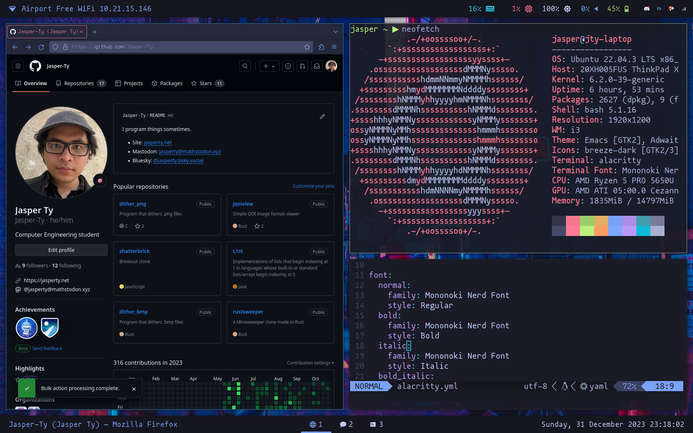

# dotfiles

## About

This holds configs for my setup. My laptop (Thinkpad X13 Gen 2a) is the source of truth. 

This setup is partially replicated on my Desktop PC.

## Info

- **OS:** Ubuntu 22.04 LTS
- **Window Manager:** i3
- **Status Bars:** polybar
- **Terminal:** alacritty
- **Shell:** bash
- **Text Editor:** Neovim
- **PDF Viewer:** zathura
- **Multiplexer:** Zellij
- **Browser:** Firefox
- **App Launcher:** rofi
- **Color Scheme:** Tokyo Night

### Misc

I use TeX Live 2022 as my LaTeX distribution

I use redshift to get a schedule blue light filter, although it's kind of annoying to use so I'm thinking of just not using it anymore.

Command Line niceties:
- **cat**: bat
- **ls**: lsd
- **top**: bottom 
- **grep**: ripgrep

## Notes

- set a udev rule to chgrp and chmod /sys/class/backlight/amdgpu_bl0/backlight.
- had to do some stupid apparmor shit I don't remember how to do to get the redshift script working

## Todo

- Change i3 code to use TOML instead of YAML
- Bash alias organization
- Use associative arrays in scripts/dotfiles
- TeX Live
- Bash path organization
- fix system tray bug, unresponsive?
- fix monitor udev rule and script
